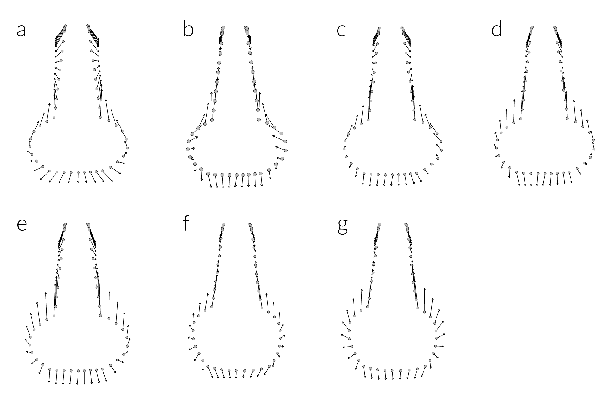

# hickory-eng

This article, entitled "Ceramic morphological organisation in the Southern Caddo Area: Quiddity of shape for Hickory Engraved bottles," was published in the [Journal of Archaeological Science: Reports](https://doi.org/10.1016/j.jasrep.2018.08.045) in 2017, and the preprint is available for download on [SocArXiv](https://osf.io/preprints/socarxiv/6rbd3/). The LaTeX scripts are included in this repository, and can be viewed on [Overleaf](https://www.overleaf.com/read/prfwtmdjzcnh). Unprocessed data have been uploaded to the Open Science Framework, and the processed meshes to Zenodo @ CERN. The unprocessed and processed datasets are embargoed for a period of five years from the most recent publication that uses them.

### Abstract

This study expands upon a previous analysis of the Clarence H. Webb collection that resulted in the identification of two bottle shapes used in the manufacture of the Hickory Engraved type. The current sample of Caddo bottles adduces three-dimensional meshes from the Hickory Engraved specimens in the Webb collection, and 14 new meshes from six sites and one collection. Results confirm that in some cases Hickory Engraved bottle shapes differ significantly by site, that the two shapes identified in the Webb collection persist in this larger sample, and that morphological integration is not significant, meaning that those traits used to characterise bottle shape (rim, neck, body, and base) were not found to vary in a coordinated manner. Thus, these results do not support the hypothesis that Caddo potters adhered to a template of vessel shape associated with specific decorative motifs. When combined with the Webb sample, iterative improvements are achieved, and results demonstrate a general trend toward standardisation in Caddo bottle shapes through time.